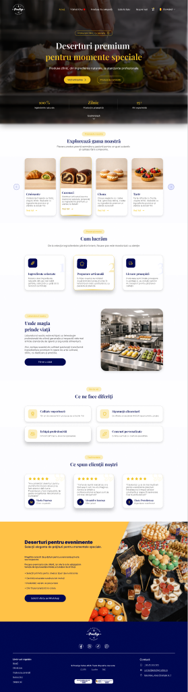

# Prestige Cakes — Figma Discovery

Generated from the designer file via Figma MCP on 2026-06-22.

| Field | Value |
|-------|-------|
| **Figma file** | [Prestige Cakes (Copy)](https://www.figma.com/design/Z4LCqR1wz1hsXOUUo1FeAX/Prestige-Cakes--Copy-) |
| **fileKey** | `Z4LCqR1wz1hsXOUUo1FeAX` |
| **MCP server** | `user-figma` (workspace `.cursor/mcp.json`) |
| **Authenticated as** | Andrei Stoica (nomorecoffeeplease@gmail.com) |

## Page inventory

| Page | nodeId | Notes |
|------|--------|-------|
| Page 1 | `0:1` | Single canvas containing all screens, components, and design-system assets |

## Customer-facing screens → Next.js routes

Desktop frames are **1440px** wide; mobile frames are **390px** wide unless noted.

### Marketing & catalog

| Figma frame | nodeId | Size | Proposed route | Priority |
|-------------|--------|------|----------------|----------|
| homepage | `2007:162` | 1440×5295 | `/` | 1 — build first |
| Homepage (mobile) | `2210:892` | 390×7765 | `/` (responsive) | 1 |
| Vitrină live | `2075:117` | 1440×2601 | `/vitrina-live` | 2 |
| Vitrina live (mobile) | `2083:4174` | 390×2652 | `/vitrina-live` | 2 |
| produse la comandă | `2350:1480` | 1440×2601 | `/produse-la-comanda` | 2 |
| Produse la comandă (mobile) | `2351:7970` | 390×2652 | `/produse-la-comanda` | 2 |
| Pagina produsului | `2030:751` | 1440×2361 | `/produse/[slug]` | 3 |
| Pagina produsului (variant) | `2250:808` | 1440×2107 | `/produse/[slug]` | 3 |
| pagina produsului (mobile) | `2114:1530` | 390×2927 | `/produse/[slug]` | 3 |

### Cart & checkout

| Figma frame | nodeId | Size | Proposed route | Priority |
|-------------|--------|------|----------------|----------|
| Coș cumpărături | `2243:13179` | 1440×2411 | `/cos` | 4 |
| Cos cumparaturi (mobile) | `2243:6364` | 390×2783 | `/cos` | 4 |
| finalizare comanda | `2361:1542` | 1440×2416 | `/checkout` | 5 |
| finalizare comanda (mobile) | `2369:1359` | 390×3416 | `/checkout` | 5 |
| finalizare comanda / ridicare personală | `2361:1728` | 1440×2360 | `/checkout/ridicare` | 5 |
| finalizare comada ridicare personala (mobile) | `2372:2217` | 390×3416 | `/checkout/ridicare` | 5 |
| daca a ales livrare rapida | `2518:984` | 1440×2416 | `/checkout` (delivery fast) | 5 |
| daca a ales livrare rapida (mobile) | `2518:1472` | 390×3416 | `/checkout` | 5 |
| split order | `2518:721` | 1440×2416 | `/checkout` (split modal) | 5 |
| modal split order (mobile) | `2518:1247` | 390×3416 | `/checkout` | 5 |
| order confirmation | `2450:627` | 1440×1929 | `/checkout/confirmare` | 6 |
| order confirmation 2 | `2436:2196` | 1440×1965 | `/checkout/confirmare` | 6 |
| order confirmation (mobile) | `2452:1007` | 390×2670 | `/checkout/confirmare` | 6 |
| order confirmation 2 (mobile) | `2443:3126` | 390×2921 | `/checkout/confirmare` | 6 |

### Navigation (shared layout)

| Figma frame | nodeId | Size | Usage |
|-------------|--------|------|-------|
| meniu desktop | `2018:685` | 1440×143 | Header/nav shell (inside homepage) |
| meniuri desktop | `2113:655` | 1670×1023 | Nav component specs |
| meniuri mobile | `2113:690` | 1670×915 | Mobile nav specs |
| meniu mobile | `2142:304` | 390×844 | Mobile menu overlay |

## Admin dashboard screens

| Figma frame | nodeId | Proposed route |
|-------------|--------|----------------|
| dashboard | `2280:513` | `/admin` |
| dashboard comenzi | `2458:3338` | `/admin/comenzi` |
| dashboard comenzi / comanda deschisă | `2456:2139` | `/admin/comenzi/[id]` |
| dashboard produse | `2280:680` | `/admin/produse` |
| dashboard adaugă produs | `2290:771` | `/admin/produse/nou` |
| dashboard editează produs | `2293:1784` | `/admin/produse/[id]/edit` |
| Sterge produs | `2359:409` | `/admin/produse` (delete modal) |
| dashboard categorii | `2293:1936` | `/admin/categorii` |
| dashboard adaugă categorie | `2296:2704` | `/admin/categorii/nou` |
| dashboard editează categoria | `2357:319` | `/admin/categorii/[id]/edit` |
| dashboard șterge categoria | `2357:529` | `/admin/categorii` (delete modal) |

## Design system / component library (not routes)

| Figma frame | nodeId | Purpose |
|-------------|--------|---------|
| Colors | `2003:19` | Color palette reference |
| Trust elements | `2013:249` | Trust badges, social proof |
| carduri | `2018:539` | Product/category cards |
| butoane desktop | `2018:549` | Button variants (desktop) |
| butoane mobile | `2114:2370` | Button variants (mobile) |
| carduri carusel | `2018:571` | Carousel cards |
| carduri produse desktop | `2105:183` | Product cards (desktop) |
| carduri produse mobile | `2112:259` | Product cards (mobile) |
| language selector | `2260:880` | i18n selector |
| testimoniale | `2024:350` | Testimonials section |
| modale | `2480:838` | Modal patterns |
| formulare desk | `2495:2080` | Form patterns (desktop) |
| formulare mobile | `2496:672` | Form patterns (mobile) |
| meniu dash | `2285:750` | Admin sidebar nav |

### Published component instances (from metadata)

- `main botton` — primary CTA
- `CTA BOTTON` — secondary CTA
- `card` — product/category card
- `Interface / Shopping_Cart_01` — cart icon
- `Arrow / Caret_Circle_Right`, `Arrow / Arrow_Right_LG`, `Arrow / Chevron_Right` — navigation icons
- `Warning / Wavy_Check` — trust badge icon

## Design tokens

See [`figma-tokens.css`](./figma-tokens.css) for CSS custom properties.

| Figma variable | Value | Suggested Tailwind key |
|----------------|-------|------------------------|
| albastru | `#000851` | `colors.brand.navy` |
| auriu | `#F0C321` | `colors.brand.gold` |
| lila | `#F0F2FF` | `colors.brand.lilac` |
| soft grey | `#F1EFEB` | `colors.neutral.soft` |
| text secudar background | `#e8e8e8` | `colors.neutral.muted` |
| Default/White | `#FFFFFF` | `colors.white` |
| icon-color | `#ffffff` | `colors.icon` |
| Medium (text style) | Inter 14/20, weight 500 | `text-sm font-medium` |

## Homepage structure (desktop `2007:162`)

Key child sections for incremental `get_design_context` calls:

| Section | nodeId | Description |
|---------|--------|-------------|
| meniu desktop | `2018:685` | Header with logo, nav links, cart, language |
| logo | `2018:686` | Circular emblem — exported to `public/brand/logo-light.svg` + `logo.svg` |
| Frame 5 (hero) | `2007:166` | Headline, subcopy, dual CTAs |
| Frame 14 | `2007:173` | Stats row (100% natural, daily production, 15+ years) |
| Desktop - 2 | `2007:304` | Product category carousel |
| (additional sections) | see metadata | Process, lab gallery, testimonials, footer |

### Hero copy (from metadata)

- Badge: *Producem zilnic, cu pasiune*
- Headline: *Deserturi premium pentru momente speciale*
- Subhead: *Produse zilnic, din ingrediente naturale, la standarde profesionale*
- Stats: *100 % Ingrediente naturale* · *Zilnic Producție proaspătă* · *15+ Ani experientă*

### Nav links (desktop)

Acasă · Vitrină Live ◉ · Produse la comandă · Galerie foto · Despre noi · Cart · Română

## Visual reference

Screenshot of desktop homepage (top portion, 1440×5295 frame):

## Pilot implementation notes

`get_design_context` on the full homepage (`2007:162`) returned **sparse metadata** — the frame is too large for a single MCP call. Implementation must split by section using the nodeIds above.

**Rate limit:** Further `get_design_context` calls were blocked (Starter plan MCP limit). When limits reset, prioritize:

1. `2018:685` — layout shell / header
2. `2007:166` — hero section
3. `2007:304` — product carousel

Use `get_screenshot` alongside each `get_design_context` call for visual parity checks.

## Recommended build order

1. **Scaffold** — Next.js + Tailwind + Convex + tokens from `figma-tokens.css`
2. **Layout shell** — `2018:685` (header/footer/nav)
3. **Homepage** — section by section from `2007:162` children
4. **Catalog** — Vitrină live, produse la comandă, product detail
5. **Cart & checkout** — full flow through confirmation
6. **Admin** — dashboard, products, categories, orders
7. **Code Connect** — map `main botton`, `card`, etc. to `.figma.tsx` files

## MCP tools used in this discovery

| Tool | Calls | Result |
|------|-------|--------|
| `whoami` | 1 | Authenticated; NMCP team (Pro) |
| `get_metadata` (pages) | 1 | 1 page: Page 1 |
| `get_metadata` (Page 1) | 1 | Full frame inventory (~14.8k lines XML) |
| `get_variable_defs` | 2 | Colors + homepage tokens |
| `get_screenshot` | 1 | Homepage preview PNG saved |
| `get_design_context` | 1 | Sparse subtree metadata (frame too large) |
