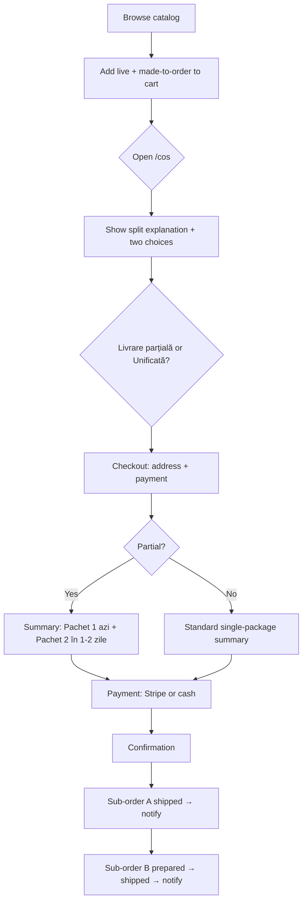

# Prestige Cakes — Functional implementation spec

Unified build requirements from:

| Source | Reference |
|--------|-----------|
| **Designer project doc** | `Prestige_Cakes_Documentatie_Text.docx` (v1.0, Mai 2026) |
| **Figma comments** | [Prestige-Cakes](https://www.figma.com/design/5spQSIosKMtvvI1k0Zkzib/Prestige-Cakes) — `5spQSIosKMtvvI1k0Zkzib` |
| **Figma visuals** | [Prestige Cakes (Copy)](https://www.figma.com/design/Z4LCqR1wz1hsXOUUo1FeAX/Prestige-Cakes--Copy-) — `Z4LCqR1wz1hsXOUUo1FeAX` |
| **Screen map** | [figma-discovery.md](./figma-discovery.md) |

> **Note:** Figma pin comments and the Copy file share node IDs. The designer Word doc is the authoritative **business-logic** reference; Figma comments add **UI interaction** detail. Where they differ (e.g. when the split-order prompt appears), prefer the Word doc unless the designer confirms otherwise.

### Refresh Figma comments

Requires `FIGMA_ACCESS_TOKEN` in `.env.local`.

```bash
curl -s -H "X-Figma-Token: $FIGMA_ACCESS_TOKEN" \
  "https://api.figma.com/v1/files/5spQSIosKMtvvI1k0Zkzib/comments?as_md=true"
```

---

## 1. Project overview

Prestige Cakes is a premium artisan bakery e-commerce platform with a public storefront and an internal admin panel.

The **defining complexity** is two product types with different availability and logistics, often combined in one cart:

| Type | Romanian label | Availability | Stock | Lead time |
|------|----------------|--------------|-------|-----------|
| **Live showcase** | Vitrină Live | Prepared daily | Managed quantity; **unavailable when stock = 0** until restocked | Same day |
| **Made to order** | Produse la comandă | Fabricated after order | No stock field — always orderable | **1–2 business days** |

This dual model drives cart UX, checkout, delivery options, order structure in the database, and admin workflows.

**UX principles (designer doc §7):**

- Communicate availability and delivery expectations **early** (PDP, cart) — no buried fine print.
- Admin panel optimizes **operational speed** (orders first, low friction catalog edits).
- Split-order flow must feel **clear and friendly**, not anxious or confusing.

---

## 2. Delivery & fulfillment model

Three fulfillment paths. Only the third is **system-triggered** (not a menu item the user picks upfront).

### 2.1 Ridicare personală (pickup)

- Client orders online, selects pickup at checkout, collects at the bakery — **no shipping cost**.
- Available for **both** product types.
- Made-to-order items: pickup after 1–2 day preparation window.
- Admin sets status **„Gata de ridicare”** (not „Expediată”); client is notified.
- **Figma:** map/address click opens Google Maps (new tab desktop; native app on mobile). See CHK-07, CHK-08.

### 2.2 Livrare la adresă — comandă simplă

- Single shipment when the cart contains **only** Vitrină Live **or** only Produse la comandă.
- One package, one delivery fee, standard checkout.

### 2.3 Livrare în două etape — split order

**Trigger:** cart contains products from **both** types simultaneously.

**When:** designer doc specifies the explanatory UI at **cart access** (`/cos`). Figma also defines a **split-order modal** during checkout (`2432:1369`, `2518:1247`) — implement cart-level choice first; reuse modal pattern at checkout if needed for confirmation/summary.

**Client chooses one of two variants:**

| Variant | Designer doc | Figma label | Behavior |
|---------|--------------|-------------|----------|
| **Partial immediate** | Livrare parțială imediată | Livrare rapidă *(preselected)* | Live products ship **today**; made-to-order ship separately in 1–2 days. **Two packages**, **two delivery fees** possible. |
| **Unified** | Livrare unificată | O singură livrare | Wait until all items ready; **one package** in 1–2 days; **one delivery fee**. |

**After partial split at checkout:** show summary of two „pachete” — what arrives today vs later (`2518:984`, confirmation variant `2436:2196` with Livrare 1 / Livrare 2).

**Backend:** persist as **one parent order** with **two sub-orders**, each with independent status (see §4.3).

---

## 3. Implementation priority

Status reflects codebase as of v0.1.8.

| P | Area | Key requirements | Status |
|---|------|------------------|--------|
| **P0** | **Data model** | Product type, stock, order + sub-order schema, status enums | Done (v0.1.9) |
| **P0** | **Split order** | Detect mixed cart; choice at `/cos`; sub-orders; checkout dual-package summary | Done (v0.1.9) |
| **P0** | **Checkout** | Stripe vs cash, dynamic CTA, delivery fee after locality, sticky summary | Partial — Stripe stub (v0.2.1) |
| **P1** | **PDP** | Show product type + lead time before add-to-cart | Done (v0.1.9) |
| **P1** | **Vitrină stock** | Hide/disable out-of-stock live products | Done (v0.2.0) |
| **P1** | **Pickup / maps** | Google Maps link behavior | Done (v0.1.9) |
| **P2** | **Product cards** | Hover/tap states, add-to-cart feedback, size vs PDP | Partial |
| **P2** | **Homepage** | Hero carousel, scroll CTA, maps, mobile nav | Partial |
| **P2** | **Catalog copy** | Produse la comandă microcopy ≠ Vitrină live | Partial |
| **P3** | **Admin** | Dashboard widgets, full CRUD, order status UI, split sub-sections | Partial — dashboard + orders (v0.2.3) |
| **P3** | **Gallery sync** | Product image → public gallery (Figma) | Not done |
| **—** | **Email UI** | Figma: „n-avem mailuri” | Out of scope v1 |
| **TBD** | **Notifications** | Designer doc: notify on status changes — channel undefined | Future |

---

## 4. Domain requirements (designer doc)

### 4.1 Product catalog (Convex schema)

| Field / rule | Vitrină Live | Produse la comandă |
|--------------|--------------|-------------------|
| `type` | `live` | `made_to_order` |
| `stockQuantity` | **Required** — decrements on order | **Absent** |
| Availability | Unavailable when stock = 0 | Always orderable |
| Lead time display | „Disponibil azi” / same day | „1–2 zile lucrătoare” |
| Admin `status` | `active` / `inactive` | same |

**Admin product form fields:** name, description, price, category, type, images, active status; stock only for live type. Edit = same form **prefilled**, submit **„Salvează schimbările”** (Figma + doc). Delete requires confirmation with **product name** shown.

**Categories:** name, description, optional cover image. **Cannot delete** category with active products. Delete confirmation shows **category name**.

**PDP (doc §5):** photos, description, price, and **clear product type / availability** before add-to-cart.

**Gallery (Figma `2250:808`):** image uploaded for a product in admin is **auto-added to public gallery**.

### 4.2 Public storefront routes

| Route | Requirements |
|-------|----------------|
| `/vitrina-live` | Live products only; respect stock |
| `/produse-la-comanda` | Made-to-order only; **different microcopy** than vitrină (Figma) |
| `/produse/[slug]` | Type + lead time visible |
| `/cos` | Split prompt when mixed cart (**doc**); sticky summary (Figma) |
| `/checkout` | Fulfillment + payment; conditional delivery line; Stripe or cash |
| `/checkout/confirmare` | Order recap; split orders may show two deliveries |

### 4.3 Orders & status machine

**Standard order statuses:**

```
Noua → Confirmata → In preparare → Expediata → Livrata
```

**Pickup branch:** `… → Gata de ridicare → Livrata` (instead of Expediata).

**Split order in admin:** single order row with **two sub-sections**:

1. **Sub-order A** — Vitrină Live items (ready to ship immediately)
2. **Sub-order B** — Produse la comandă (1–2 day lead)

Each sub-section has **independent status**. Admin processes them at different times. Expediata orders include **courier tracking number** (doc §6).

**Notifications:** designer doc expects client notification at relevant status transitions. Figma excludes email UI for v1 — implement status in DB + admin first; notification channel (SMS/push/email) is a follow-up.

### 4.4 Admin panel structure

Fixed **left sidebar** (always visible): **Dashboard**, **Comenzi**, **Produse**, **Categorii**.

#### Dashboard (`/admin`) — four widgets

| Widget | Data |
|--------|------|
| Active products | Count of `status = active` products |
| New orders | Count of orders in `Noua` (unprocessed) |
| Best seller | Top product by units sold |
| Top 5 | Five best-selling products |

Link to public website opens in **new tab** (Figma). Card hover shadows (Figma).

#### Comenzi (`/admin/comenzi`, `/admin/comenzi/[id]`)

- Filter by status / type
- Order detail: line items grid wraps after **3 per row** (Figma)
- Status dropdown drives workflow
- Split orders: two sub-sections UI

#### Produse / Categorii

- Full CRUD per §4.1
- Sidebar: logout hover style differs (Figma)

---

## 5. Essential user flows (designer doc §6)

### 5.1 Split order — client



### 5.2 Admin — new standard order

1. Order appears as **Noua**
2. Admin reviews products, client data, fulfillment method
3. **Pickup:** prepare → **Gata de ridicare** → notify client
4. **Delivery:** prepare → add tracking → **Expediata** → notify
5. **Livrata** when received

### 5.3 Admin — product lifecycle

1. Produse → Add → fill form (type + stock if live) → save
2. If **Activ**, visible on storefront immediately
3. Edit prefilled form or set **Inactiv** to hide without delete

---

## 6. Figma UI requirements (pin comments)

Grouped by priority. IDs like `CHK-01` cross-reference §7 checklist.

### P0 — Checkout & payments

#### Delivery checkout — `2361:1542` → `/checkout`

| ID | Requirement |
|----|-------------|
| CHK-01 | Delivery line in summary **only after locality selected** |
| CHK-02 | **Sticky** order summary on scroll |
| CHK-03 | Card online → **Stripe** |
| CHK-04 | Cash on delivery → **skip Stripe**, go to confirmation |
| CHK-05 | Cash selected → CTA **„Finalizează comanda”** |
| CHK-06 | Pickup selected → **„Numerar la ridicarea comenzii”** (not „la livrare”) |

#### Pickup — `2361:1728`, `2372:2217`

| ID | Requirement |
|----|-------------|
| CHK-07 | Address/map → Google Maps new tab (desktop) |
| CHK-08 | Mobile → may open Maps app |
| CHK-09 | Card online → Stripe |

#### Split modal (Figma) — `2432:1369`, `2518:1247`

| ID | Requirement |
|----|-------------|
| CHK-10 | Copy: **„Livrare mai rapidă?”** + mixed-cart explanation |
| CHK-11 | **„Livrare rapidă” preselected** |
| CHK-12 | Partial → two shipments / two order numbers possible |
| CHK-13 | **„O singură livrare”** unified option |
| CHK-14 | Post-choice banner: **„Produsele au fost împărțite în două comenzi”** |

### P1 — Cart

| ID | Requirement |
|----|-------------|
| CRT-01 | Sticky order summary |
| **CRT-02** | **(Doc)** Mixed cart → split choice UI at **`/cos`** — not only at checkout |

### P2 — Homepage

| ID | Requirement |
|----|-------------|
| HOM-01 | Hero images auto-rotate |
| HOM-02 | Scroll CTA + floating arrow animation |
| HOM-03 | Location → Google Maps new tab |
| HOM-04 | Mobile: **no logo in top nav** (hero only) |

### P2 — Catalog & cards

| ID | Requirement |
|----|-------------|
| CAT-01 | Filter chip states: default / hover / selected |
| CAT-02 | Produse la comandă microcopy ≠ Vitrină live |
| CAT-03 | Card hover/tap: shadows, gold details |
| CAT-04 | Add-to-cart button states incl. „produs adăugat în coș” |
| CAT-05 | Catalog CTAs **larger** than on PDP |
| CAT-06 | Shared card component desktop + mobile |
| HOM-05 | Carousel card lift + ~10% image zoom on hover |
| HOM-07 | Trust badges: hover shadow / icon / radius |

### P3 — Admin (Figma UI polish)

| ID | Requirement |
|----|-------------|
| ADM-01 | Edit forms prefilled + „Salvează schimbările” |
| ADM-02 | Delete category modal shows name |
| ADM-03 | Delete product modal shows name |
| ADM-04 | Order detail: >3 products wrap to next row |
| ADM-05 | Dashboard link → website new tab |
| ADM-06 | Dashboard card hover shadows |
| ADM-07 | Sidebar logout distinct hover |
| PDP-01 | Product image → auto gallery entry |

### Out of scope (Figma)

Admin frames marked **„n-avem mailuri”** — no email module in admin UI for v1.

---

## 7. Full Figma comment log

130 root threads exported 2026-06-22. State labels (`def`, `hov`, `tap`, …) document component states for visual polish.

<details>
<summary>Homepage & marketing</summary>

**`2007:162` / `/`** — maps new tab; hero auto-rotate; scroll CTA + floating arrow; hover states

**`2210:892` / `/`** — mobile: no logo in top menu (hero only); tap states

**`2018:571`** — carousel hover: lift, shadow, 10% image zoom; same cards mobile/desktop

**`2013:249`** — trust badges: hover shadow, icon size, corner radius

</details>

<details>
<summary>Catalog</summary>

**`2075:117`** — filter hover/selected

**`2350:1480`, `2351:7970`** — produse la comandă: different microcopy

**`2018:539`, `2018:549`** — card interactions; button states; catalog CTAs larger than PDP

</details>

<details>
<summary>Cart & checkout</summary>

**`2243:13179`** — sticky summary

**`2361:1542`, `2369:1359`** — delivery after locality; sticky; Stripe/cash routing; CTA labels

**`2361:1728`, `2372:2217`** — Stripe; maps behavior

**`2432:1369`, `2518:1247`** — split modal: preselect Livrare rapidă

</details>

<details>
<summary>Product & admin</summary>

**`2250:808`** — image → gallery sync

**`2456:2139`** — order detail grid wrap

**`2357:319`, `2357:529`, `2359:409`, `0:1`** — edit prefilled / delete names / save button

**`2280:513`, `2285:750`** — dashboard link; sidebar logout hover

**`2149:*`–`2156:*`** — no email UI

</details>

---

## 8. Related docs

- [figma-discovery.md](./figma-discovery.md) — Figma frames, node IDs, build order
- `Prestige_Cakes_Documentatie_Text.docx` — designer business specification (v1.0)
- `docs/release-v0.1.*-notes.md` — shipped visual milestones
